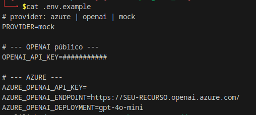
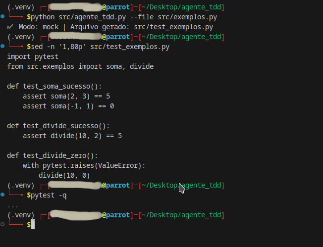
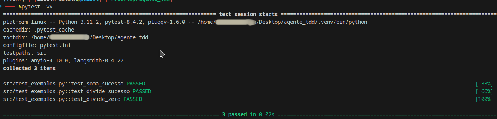
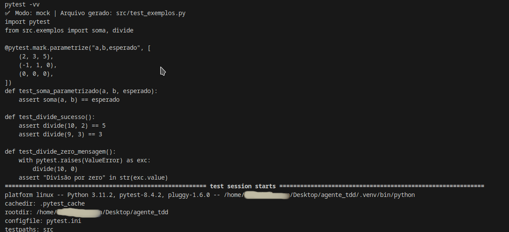
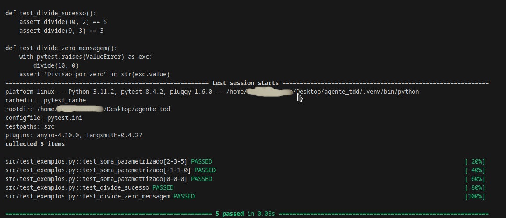
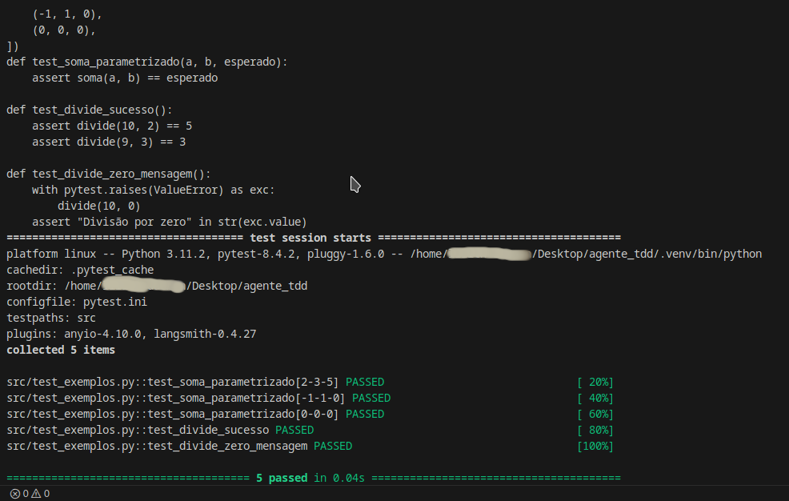

# Agente TDD – Geração Automática de Testes com LangChain (Azure/OpenAI/Mock)

Agente em Python que recebe um arquivo/trecho de código Python e gera automaticamente testes unitários em pytest.

# 📁 Estrutura do Projeto

agente_tdd/
├── src/
│   ├── __init__.py
│   ├── exemplos.py          
│   └── agente_tdd.py        # agente híbrido (mock/openai/azure)
│
├── .env.example             # variáveis de ambiente (copie para .env)
├── pytest.ini               # limita coleta ao diretório src
├── requirements.txt
├── .gitignore
└── README.md

# ✨ O que este agente faz

- Lê um arquivo Python (por padrão src/exemplos.py).

- Gera um arquivo de testes em pytest no formato src/test_<nome>.py.

- Sempre inicia com import pytest e cria def test_* para casos de sucesso e falha.

- Pode rodar:

    - Mock (offline): não usa rede; ótimo para avaliação rápida.

    - OpenAI público: via ChatOpenAI (langchain).

    - Azure OpenAI: via AzureChatOpenAI (langchain).

# 🚀 Começando
## 1) Ambiente

    python3 -m venv .venv
    source .venv/bin/activate        # Windows (PowerShell): .venv\Scripts\Activate.ps1
    pip install --upgrade pip
    pip install -r requirements.txt

## 2) Variáveis de Ambiente

Crie seu .env a partir do exemplo:

    cp .env.example .env

Conteúdo do .env.example:

    # provider: azure | openai | mock
    PROVIDER=mock

    # --- OPENAI público ---
    OPENAI_API_KEY=

    # --- AZURE ---
    AZURE_OPENAI_API_KEY=
    AZURE_OPENAI_ENDPOINT=https://SEU-RECURSO.openai.azure.com/
    AZURE_OPENAI_DEPLOYMENT=gpt-4o-mini

# 🧪 Rodando o Agente e os Testes
## Modo 1 – Mock (offline)

Não usa rede e gera um teste funcional de exemplo.

    # no .env: PROVIDER=mock
    python src/agente_tdd.py --file src/exemplos.py
    pytest

Saída esperada:

    ✅ Modo: mock | Arquivo gerado: src/test_exemplos.py
    ...                                                                                      [100%]
    3 passed in 0.01s

## Modo 2 – OpenAI (API pública)

    # .env

    PROVIDER=openai
    OPENAI_API_KEY=sk-...        # sua chave pública da OpenAI

    python src/agente_tdd.py --file src/exemplos.py
    pytest

## Modo 3 – Azure OpenAI

    # .env
    PROVIDER=azure
    AZURE_OPENAI_API_KEY=xxxxx
    AZURE_OPENAI_ENDPOINT=https://SEU-RECURSO.openai.azure.com/
    AZURE_OPENAI_DEPLOYMENT=gpt-4o-mini

    python src/agente_tdd.py --file src/exemplos.py
    pytest

# 📌 Exemplos

Arquivo de entrada (src/exemplos.py):

    def soma(a, b):
        return a + b

    def divide(a, b):
        if b == 0:
            raise ValueError("Divisão por zero não permitida")
        return a / b

Execução:

    python src/agente_tdd.py --file src/exemplos.py
    # gera: src/test_exemplos.py
    pytest

# 🧩 Como funciona (resumo técnico)

- LangChain:

  - ChatOpenAI (OpenAI público) ou AzureChatOpenAI (Azure).

  - PromptTemplate direciona a saída para pytest puro, com import pytest na primeira linha e def test_*.

- Híbrido por .env:

  - PROVIDER=mock → gera testes fixos de exemplo (offline).

  - PROVIDER=openai → usa OPENAI_API_KEY e model=gpt-4o-mini.

  - PROVIDER=azure → usa AZURE_OPENAI_* e deployment=gpt-4o-mini.

- pytest.ini restringe a coleta à pasta src e ignora .venv (evita rodar testes de libs instaladas).

## Configuração

Exemplo do arquivo `.env.example`:

Configuração do `.env` com provider em **mock**:

---

## Execução em modo mock (offline)

Geração automática de testes a partir do arquivo `exemplos.py`:

Arquivo de teste gerado (`test_exemplos.py`):

---

## Rodando os testes

Execução detalhada com `pytest -vv`:

---

## Testes enriquecidos

Versão dos testes com `@pytest.mark.parametrize` e checagem de exceção:

---

## Execução com OpenAI

Exemplo de execução configurando `PROVIDER=openai`:

# 🛡️ Segurança & Boas Práticas

- Nunca comite chaves no repositório.

- Use .env (já ignorado) ou gerenciadores de segredo.

- Padronize o nome de deploy no Azure (ex.: gpt-4o-mini) para espelhar o modelo e facilitar documentação.

- pytest.ini evita coleta dentro de .venv, node_modules, etc.

# 🧰 Troubleshooting
ModuleNotFoundError: No module named 'src'

- Garanta que src/__init__.py exista (mesmo vazio).

- Ou ajuste o import no teste para from exemplos import soma, divide (e mantenha testpaths = src no pytest.ini).

pytest rodando testes da .venv

- Certifique-se de que o pytest.ini contém:

    [pytest]
    addopts = -q
    testpaths = src
    norecursedirs = .venv venv env node_modules build dist

## .env não carregado

- Confirme from dotenv import load_dotenv + load_dotenv() no início.

- Para debug:

    python - <<'PY'
    import os
    from dotenv import load_dotenv
    load_dotenv(".env")
    print("PROVIDER =", os.getenv("PROVIDER"))
    PY

## openai.APIConnectionError / DNS

  - Verifique AZURE_OPENAI_ENDPOINT (tem que ser https://<recurso>.openai.azure.com/).

  - Verifique conectividade/Proxy.

# 📜 Licença

Este projeto é distribuído sob a licença MIT. Sinta-se à vontade para usar e adaptar.

# 🙌 Créditos

- LangChain, langchain-openai

- pytest

- python-dotenv
